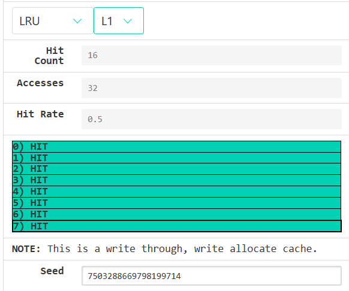
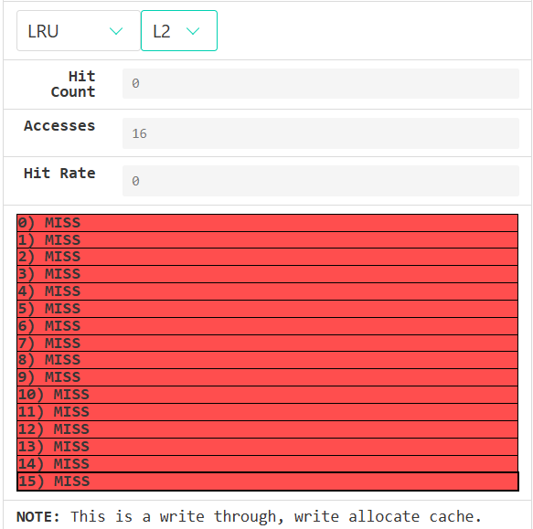
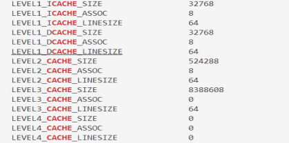

# README-Cache

In this experiment, I first used Venus visualization tool to explore the caching mechanism, including the computer cache operation mechanism corresponding to common operations such as array computation and matrix transposition.

Some of the results are as follows:

I then used `memory mountain` code to explore my own computer's cache and the nature of temporal and spatial locality, and obtained the following data:

Also found out the basic situation of the computer's caches at all levels:

This is the general content of the experiment, other details can be seen in the PDF file: homework.pdf (written in Chinese)
