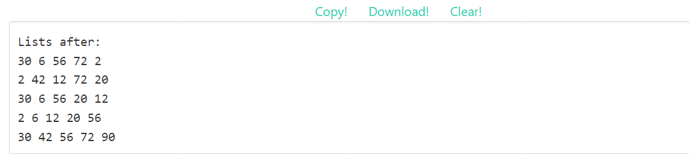
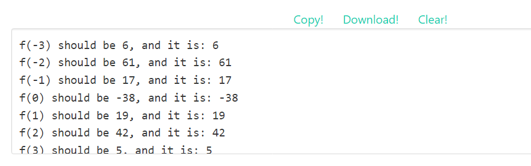

# README

## **RISC-V** **汇编语言 LAB**

### Goals

+ Familiarize myself with using the Venus emulator

+ Practice running and debugging RISC-V assembly code.

+ Write RISC-V functions.

+ Understand the implementation of nested function calls, pointers, arrays, and linked lists in assembly language

+ Understand the multiple uses of variable-address addressing methods

 

### **Introduction to the RISC-V Emulator**

Assembly language is a low-level language close to machine code. Because your computer can only run (x86 or ARM) machine code, it is not possible to directly execute RISC-V code directly on your machine. So use the RISC-V emulator [Venus](https://venus.cs61c.org/). You can learn how to use it by looking at the Venus [reference](https://inst.eecs.berkeley.edu/~cs61c/sp21/resources/venus-reference) manual.

### Summary

In RISC-V assembly language labs, I implemented functions capable of calculating the square of a number in a loop, functions capable of calculating x*(x+1) corresponding to each value x in a chained table node, functions capable of mapping -3,-2,-1,0,1,2,3 to 6,61,17,-38,19, according to the requirements of my homework assignment (see the docx file), and functions capable of mapping -3,-2,-1,0,1,2,3 to 6,61,17,-38,19, 42,5 functions.

And the outputs are like:

And:

I think that in the actual process of writing the function, the more important thing is the use of registers in the loop (recursion) (each special register and its function, etc.) as well as the individual assembly instructions. If the registers are not used correctly, it is likely to lead to problems with the computer's order of operations during the recursion; and the skillful use of assembly instructions is an essential skill when writing functions. In completing the assignment, it was my failure to master the use of registers that caused the assignment to take me some time to complete.

The code can be found in the code folder and the results are shown in the individual images.

